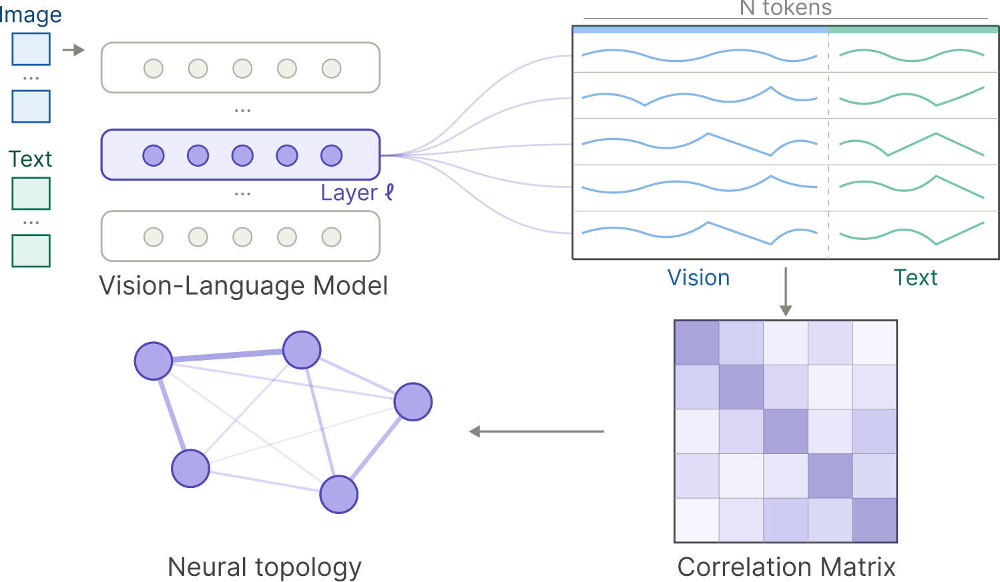

# Structural Graph Probing of Vision–Language Models

[](https://arxiv.org/abs/2603.27070)
[](https://arxiv.org/abs/2603.27070)
[](LICENSE)
[](https://www.python.org/)

**[Paper](https://arxiv.org/abs/2603.27070)** | **[PDF](https://arxiv.org/pdf/2603.27070)**

> **Haoyu He, Yue Zhuo, Yu Zheng, Qi R. Wang**
> IEEE/CVF Conference on Computer Vision and Pattern Recognition (CVPR) 2026



## Abstract

Vision-language models (VLMs) achieve strong multimodal performance, yet how computation is organized across populations of neurons remains poorly understood. In this work, we study VLMs through the lens of **neural topology**, representing each layer as a within-layer correlation graph derived from neuron-neuron co-activations. This view allows us to ask whether population-level structure is behaviorally meaningful, how it changes across modalities and depth, and whether it identifies causally influential internal components under intervention. We show that correlation topology carries **recoverable behavioral signal**; moreover, cross-modal structure progressively consolidates with depth around a compact set of **recurrent hub neurons**, whose targeted perturbation substantially alters model output. Neural topology thus emerges as a meaningful intermediate scale for VLM interpretability: richer than local attribution, more tractable than full circuit recovery, and empirically tied to multimodal behavior.

## Key Findings

- **Topology encodes behavior.** Neuron-neuron correlation graphs carry signal predictive of VQA correctness — GCN classifiers trained on these graphs outperform MLP baselines using last-token activations alone.
- **Cross-modal consolidation.** Visual and textual representations progressively align with depth; visual–textual (VT) correlation strengthens in later layers across all tested VLMs.
- **Hub neurons are causally influential.** A small set of high-degree neurons recur consistently across samples and layers; ablating them substantially degrades model accuracy, confirming their causal role.
- **Topology is architecture-agnostic.** Findings hold consistently across LLaVA, Qwen2.5-VL, InternVL3, and Gemma3 model families.

## Repository Layout

**Core modules:**

- `model.py` — model loading, hidden-state extraction, correlation graph construction, `GCNPredictor` / `MLPPredictor`
- `dataset.py` — dataset loading and VQA prompt construction
- `utils.py` — shared helpers, constants, and text sanitization utilities

**Experiment scripts** (under `probing/`):

| Script                | Description                                                                         |
| --------------------- | ----------------------------------------------------------------------------------- |
| `extract_graphs.py`   | Extract hidden states, build sparse correlation graphs, save per-layer artifacts    |
| `predict_gcn.py`      | Train GCNPredictor on extracted graphs to probe behavioral signal in topology       |
| `degree_analysis.py`  | Layer-wise degree and last-token activation analysis across all layers              |
| `hub_neurons.py`      | Identify hub neurons by degree / activation frequency across samples                |
| `intervene_neuron.py` | Neuron-level ablation / scaling intervention experiments                            |
| `intervene_edge.py`   | Edge-level (neuron-pair) intervention experiments                                   |
| `modality_corr.py`    | Cross-modality (visual-text) token correlation analysis                             |

**Runner scripts:** `scripts/` — ready-to-run shell scripts for each pipeline step (start here).

## Environment Setup

```bash
conda create -n vlm-graph-probing python=3.10
conda activate vlm-graph-probing
pip install -r requirements.txt
```

> **Notes:**
> - A working PyTorch installation compatible with your CUDA setup is required for GPU experiments.
> - Some Hugging Face model checkpoints may require authentication or acceptance of model terms.

## Supported Models

| Model              | Hugging Face checkpoint                                                                        |
| ------------------ | ---------------------------------------------------------------------------------------------- |
| LLaVA-1.5-7B       | [llava-hf/llava-1.5-7b-hf](https://huggingface.co/llava-hf/llava-1.5-7b-hf)                   |
| LLaVA-1.5-13B      | [llava-hf/llava-1.5-13b-hf](https://huggingface.co/llava-hf/llava-1.5-13b-hf)                 |
| LLaVA-v1.6-Mistral | [llava-hf/llava-v1.6-mistral-7b-hf](https://huggingface.co/llava-hf/llava-v1.6-mistral-7b-hf) |
| Qwen2.5-VL-3B      | [Qwen/Qwen2.5-VL-3B-Instruct](https://huggingface.co/Qwen/Qwen2.5-VL-3B-Instruct)             |
| Qwen2.5-VL-7B      | [Qwen/Qwen2.5-VL-7B-Instruct](https://huggingface.co/Qwen/Qwen2.5-VL-7B-Instruct)             |
| InternVL3-1B       | [OpenGVLab/InternVL3-1B-hf](https://huggingface.co/OpenGVLab/InternVL3-1B-hf)                 |
| InternVL3-2B       | [OpenGVLab/InternVL3-2B-hf](https://huggingface.co/OpenGVLab/InternVL3-2B-hf)                 |
| InternVL3-8B       | [OpenGVLab/InternVL3-8B-hf](https://huggingface.co/OpenGVLab/InternVL3-8B-hf)                 |

See `utils.py` for the complete list of supported checkpoints.

## Data Setup

| Dataset   | Source                                                         | Setup                                                                                            |
| --------- | -------------------------------------------------------------- | ------------------------------------------------------------------------------------------------ |
| **CLEVR** | HuggingFace                                                    | Loaded automatically via `datasets` (`laion/clevr-webdataset`). No manual download needed.      |
| **COCO**  | HuggingFace                                                    | Loaded automatically via `datasets` (`lmms-lab/COCO-Caption2017`). No manual download needed.   |
| **TDIUC** | [Manual download](https://kushalkafle.com/projects/tdiuc.html) | Download and place under `data/TDIUC/`. Also requires COCO val2014 images under `data/val2014/`. |

For TDIUC, the expected directory structure is:

```
data/
├── TDIUC/
│   ├── Questions/
│   │   └── OpenEnded_mscoco_val2014_questions.json
│   └── Annotations/
│       └── mscoco_val2014_annotations.json
└── val2014/
    └── COCO_val2014_*.jpg
```

You can override dataset locations via CLI flags or environment variables:

```bash
export VLM_GRAPH_DATA_ROOT=/path/to/data
export VLM_GRAPH_TDIUC_ROOT=/path/to/data/TDIUC
export VLM_GRAPH_COCO_VAL_ROOT=/path/to/data/val2014
```

## Quickstart

Ready-to-run scripts live under `scripts/`. Each script has configurable variables (model, dataset, device, etc.) at the top. Run them in order:

```bash
# Step 1: Extract hidden states → per-layer correlation graphs + last-token activations
bash scripts/01_extract_graphs.sh

# Step 2: Train GCNPredictor → probes whether graph topology predicts VQA correctness
bash scripts/02_predict_gcn.sh

# Step 3: Layer-wise degree & activation statistics → avg_node_degree / avg_last_token .npy
bash scripts/03_degree_analysis.sh

# Step 4: Hub neuron identification → hub_neurons_<model>_<dataset>_<category>_top<k>.json
bash scripts/04_hub_neurons.sh

# Step 5: Neuron-level intervention → accuracy delta vs. baseline (requires step 4 output)
bash scripts/05_intervene_neuron.sh

# Step 6: Edge-level intervention → top-k edge ablation accuracy results
bash scripts/06_intervene_edge.sh

# Step 7: Cross-modality correlation → per-layer VV / TT / VT correlation .npz files
bash scripts/07_modality_corr.sh
```

All scripts default to **InternVL3-1B** on **CLEVR color** with `cuda:0`. Edit the variables at the top of each script to change the model, dataset, category, or GPU device.

## Citation

If you use this code in your research, please cite our paper:

```bibtex
@inproceedings{he2026structural,
  title={Structural Graph Probing of Vision-Language Models},
  author={He, Haoyu and Zhuo, Yue and Zheng, Yu and Wang, Qi R.},
  booktitle={Proceedings of the IEEE/CVF Conference on Computer Vision and Pattern Recognition (CVPR)},
  year={2026}
}
```

## License

This project is licensed under the MIT License. See [LICENSE](LICENSE) for details.
